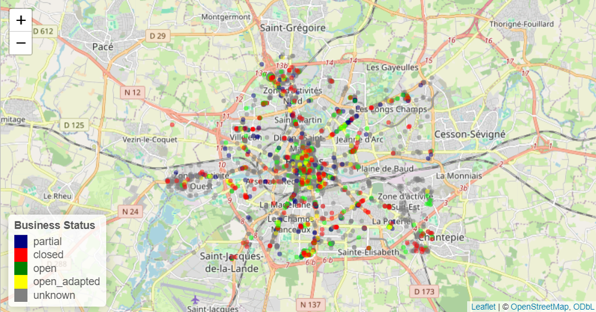

# Covide-anlayse
#####  Le covid avait influencé pleinement beaucoup de secteurs dans plusieurs villes.
#####  Sur la cartographie suivante, on illustre pour la ville de Rennes les états principaux des différents secteurs.  

#####  Les restaurants et les fast-foods étaient beaucoup moins touchés que les cafétérias et les bars.

